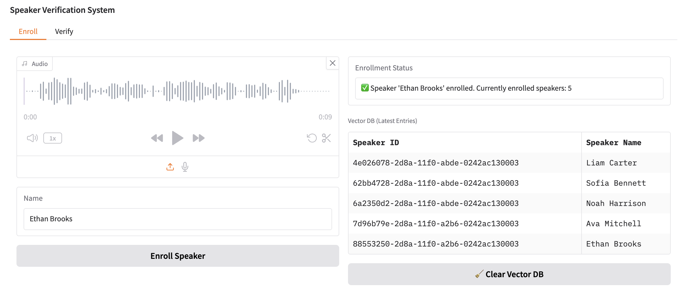
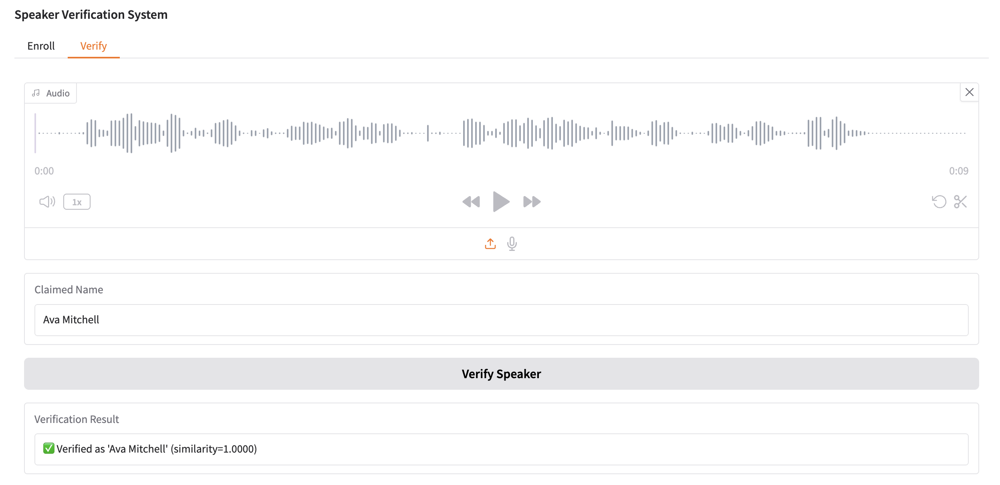

# speaker-verification

A speaker verification system using [SpeechBrain](https://speechbrain.readthedocs.io) for speaker embedding extraction
and [Qdrant](https://qdrant.tech) as a vector similarity search engine. This app includes a Gradio UI for enrolling and
verifying speakers via audio input.




## Features

- Speaker embedding with SpeechBrain x-vector model
- Persistent storage with Qdrant
- Simple Gradio interface for interaction

## Project Structure

```
speaker-verification/
├── app/
│   ├── interface.py      # Gradio UI logic
│   └── verifier.py       # Core verification logic
├── data/                 # Audio samples
├── images/               # App screenshots
├── pretrained_models/    # SpeechBrain downloads here
├── doceker-compose.yml   # Docker Compose file
├── Dockerfile
├── requirements.txt
├── README.md
└── main.py               # Entry point
```

## Getting Started

### Prerequisites

- Docker or Python 3.9+
- Qdrant (Run locally: `docker run -p 6333:6333 qdrant/qdrant`)

### Run with Python

```bash
pip install -r requirements.txt
python main.py
```

### Run with Docker

Run the following command to build and start the Docker containers using docker-compose:

```bash
docker-compose up --build
```
Once containers are up and running, the application will be accessible at:

```bash
http://0.0.0.0:7860
```

To stop and remove the containers, use the following command:

```bash
docker-compose down
```

## Notes

- Audio files must be `.wav` format.
- Only supports cosine similarity matching.
